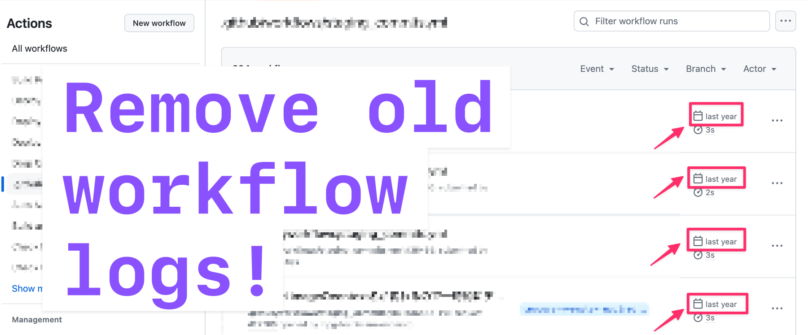

[](https://github.com/toshimaru/gh-workflow-log-cleaner/actions/workflows/test.yml)

# GitHub Workflow Log Cleaner

Clean up your outdated GitHub Actions workflow logs.



## Usage

```console
$ gh workflow-log-cleaner "Your Workflow Name (<workflow-id> or <workflow-name> or <filename>)"
```

## Example

```console
$ gh workflow-log-cleaner test
```

```console
$ gh workflow-log-cleaner test --limit 10
```

## Don't know your workflow name?

If you don't know your workflow name or workflow id, you can find it by running `gh workflow-log-cleaner` without any arguments.

```console
$ gh workflow-log-cleaner
USAGE
gh workflow-log-cleaner [<workflow-id> | <workflow-name> | <filename>] [options]

OPTIONS
  -h, --help    Show this help message and exit
  --limit int   Limit the number of runs to delete (default: 1000)

EXAMPLES
  Remove logs for the test workflow
  $ gh workflow-log-cleaner test

AVAILABLE WORKFLOWS
NAME   STATE   ID
setup  active  114854128
test   active  114855097
```
