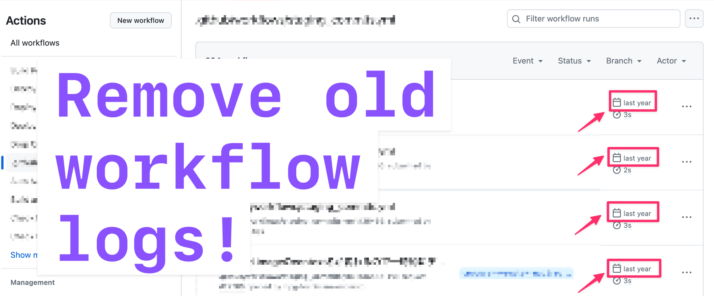

[](https://github.com/toshimaru/gh-workflow-log-cleaner/actions/workflows/test.yml)

# GitHub Workflow Log Cleaner



## Usage

```console
$ gh workflow-log-cleaner "Your Workflow Name (<workflow-id> or <workflow-name> or <filename>)"
```
