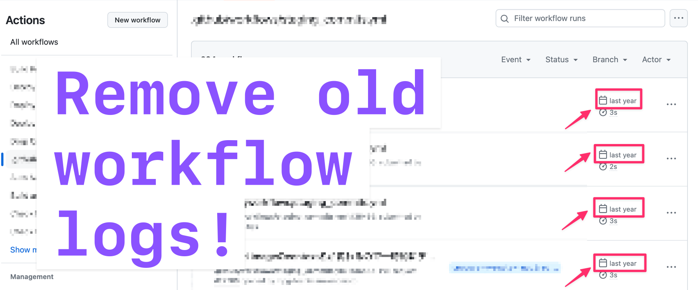

[](https://github.com/toshimaru/gh-workflow-log-cleaner/actions/workflows/test.yml)

# GitHub Workflow Log Cleaner

A GitHub CLI extension to delete outdated GitHub Actions workflow run logs in bulk.



## Prerequisites

- [GitHub CLI (`gh`)](https://cli.github.com/) installed and authenticated

## Install

```console
$ gh extension install toshimaru/gh-workflow-log-cleaner
```

## Usage

```console
$ gh workflow-log-cleaner [<workflow-id> | <workflow-name> | <filename>] [options]
```

### Options

| Option | Description |
|--------|-------------|
| `-h`, `--help` | Show help message and exit |
| `--limit int` | Limit the number of runs to delete (default: 1000) |

## Examples

```console
# Delete logs by workflow name
$ gh workflow-log-cleaner test

# Delete logs by workflow ID
$ gh workflow-log-cleaner 114855097

# Delete logs by filename
$ gh workflow-log-cleaner test.yml

# Delete only the last 10 runs
$ gh workflow-log-cleaner test --limit 10

# --limit can also be placed before the workflow name
$ gh workflow-log-cleaner --limit 10 test
```

## Don't know your workflow name?

Run `gh workflow-log-cleaner` without arguments to see available workflows:

```console
$ gh workflow-log-cleaner
USAGE
gh workflow-log-cleaner [<workflow-id> | <workflow-name> | <filename>] [options]

OPTIONS
  -h, --help    Show this help message and exit
  --limit int   Limit the number of runs to delete (default: 1000)

EXAMPLES
  Remove logs for the test workflow
  $ gh workflow-log-cleaner test

AVAILABLE WORKFLOWS
NAME   STATE   ID
setup  active  114854128
test   active  114855097
```
